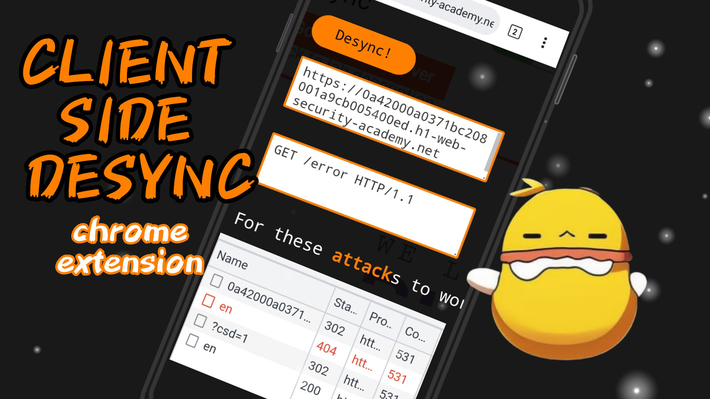

# Client Side Desync Chrome Extension

## Introduction

This Chrome extension is designed to assist mobile users, providing a tool specifically focused on detecting Client Side Desynchronization (CSD) vulnerabilities in web applications. Developed with a mobile-centric approach, this extension offers valuable insights into potential security gaps, contributing to a safer web experience.

## Features

- **CSD Vulnerability Detection**: Identify and explore potential Client Side Desync vulnerabilities.
- **Mobile-friendly Interface**: Tailored for users who predominantly navigate the web on mobile devices.

## Installation

1. Clone this repository or download the ZIP file.
2. Open Chrome and go to `chrome://extensions/`.
3. Enable "Developer mode" in the top right corner.
4. Click "Load unpacked" and select the folder where you cloned or extracted the extension files.

## Usage

1. Navigate to a webpage you want to test.
2. Open Chrome Developer Tools (`Ctrl + Shift + I` or right-click and select "Inspect").
3. Locate the "Client Side Desync" tab.
4. Input the URL and any relevant data.
5. Click the "Desync!" button to initiate the CSD attack.
6. Check the Chrome Developer Tools' Network tab for potential anomalies.

## Contributing

Feel free to contribute to this project by opening issues, suggesting features, or submitting pull requests. Your input is highly valued!

## License

This project is licensed under the [MIT License](LICENSE).

## Author

- roninja
- https://gudetama.cf

